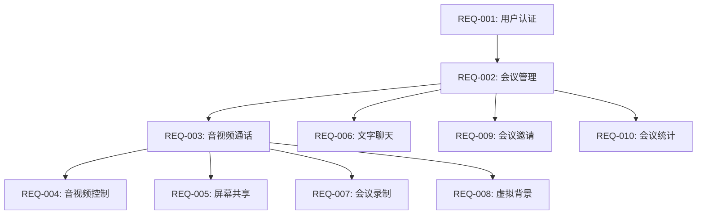

# v0.1 MVP 需求列表

## 版本信息

- **版本号**: v0.1
- **版本类型**: MVP
- **规划日期**: 2026-02-13
- **更新日期**: 2026-02-13
- **参考**: [v0.1 版本规划](./plan.md)

## 平台支持范围

**MVP (v0.1) 支持平台**:
- ✅ **Web 端**: Chrome 90+, Safari 14+, Firefox 88+, Edge 90+
- ✅ **桌面端**: Electron（Windows 10+, macOS 11+）
  - 复用 Web 端 80% 代码
  - 支持 Windows 和 macOS

**延后到 v0.2**:
- ⏸️ iOS 原生 App（iOS 13+）
- ⏸️ Android 原生 App（Android 8.0+）

**决策理由**:
- MVP 聚焦验证核心音视频技术（WebRTC + SFU）
- 12周时间线内保证 Web + Electron 高质量交付
- 避免多平台同步开发导致的资源分散和质量风险
- 企业会议场景以桌面端为主，移动端为辅助场景

## 需求分级

- **P0**: 核心功能,必须完成,阻塞发版
- **P1**: 重要功能,优先完成,影响体验
- **P2**: 优化功能,资源允许时完成

## 功能需求列表

### REQ-001: 用户认证系统 (P0)

**优先级**: P0
**负责 Team**: 后端 + 前端 + 客户端
**依赖**: 无

#### 功能描述

实现用户注册、登录、登出、Token 刷新等基础认证功能。

#### User Stories

- 作为新用户,我可以通过邮箱和密码注册账号
- 作为已注册用户,我可以通过邮箱和密码登录
- 作为登录用户,我可以安全登出
- 作为用户,我的登录状态可以自动保持 (Refresh Token)

#### 功能点

- 用户注册 (邮箱 + 密码 + 昵称)
- 邮箱格式校验
- 密码强度校验 (至少 8 位,包含字母和数字)
- 用户登录 (JWT Token)
- Token 自动刷新机制
- 登出 (Token 失效)
- 用户信息查询

#### 验收标准

- [ ] 用户可成功注册并收到成功提示
- [ ] 注册后自动登录
- [ ] 登录后获得有效 Token
- [ ] Token 过期前自动刷新
- [ ] 登出后 Token 失效
- [ ] 密码采用 bcrypt 加密存储
- [ ] API 限流防止暴力破解
- [ ] 单元测试覆盖率 > 90%

#### Team 分工

| Team | 工作内容 | 交付物 |
|------|---------|--------|
| 后端 | 用户服务 API、JWT 实现、数据库设计 | RESTful API + 数据库表 |
| 前端 | 注册/登录页面、Token 管理 | Web 登录/注册 UI + 状态管理 |
| 客户端 | Electron 集成 | Electron 桌面端登录页面 |
| 测试 | 接口测试、端到端测试 | 测试用例 + 测试报告 |

---

### REQ-002: 会议管理 (P0)

**优先级**: P0
**负责 Team**: 后端 + 前端 + 客户端
**依赖**: REQ-001 用户认证

#### 功能描述

实现会议创建、加入、列表查看、会议信息查询等核心会议管理功能。

#### User Stories

- 作为用户,我可以创建会议并获得会议号
- 作为用户,我可以通过会议号加入会议
- 作为用户,我可以查看我创建的会议列表
- 作为用户,我可以查看我参加过的会议列表
- 作为会议创建者,我可以结束会议

#### 功能点

- 创建会议 (生成 9 位会议号)
- 加入会议 (输入会议号)
- 会议列表查询 (我的会议/历史会议)
- 会议详情查询 (参与人员、开始时间、持续时长)
- 结束会议 (仅创建者)
- 会议状态管理 (未开始/进行中/已结束)

#### 验收标准

- [ ] 用户可成功创建会议并获得会议号
- [ ] 用户可通过有效会议号加入会议
- [ ] 输入无效会议号时给出友好提示
- [ ] 会议列表正确显示
- [ ] 会议创建者可结束会议
- [ ] 会议结束后用户自动退出
- [ ] 单元测试覆盖率 > 90%

#### Team 分工

| Team | 工作内容 | 交付物 |
|------|---------|--------|
| 后端 | 会议管理 API、数据库设计 | RESTful API + 数据库表 |
| 前端 | 创建/加入会议 UI、会议列表 | Web 会议管理页面 |
| 客户端 | Electron 集成 | Electron 桌面端会议管理 |
| 测试 | 接口测试、端到端测试 | 测试用例 + 测试报告 |

---

### REQ-003: 实时音视频通话 (P0)

**优先级**: P0
**负责 Team**: 后端 + 前端 + 客户端
**依赖**: REQ-002 会议管理

#### 功能描述

实现 2-4 人实时音视频通话,包括音视频采集、编码、传输、解码、渲染。

#### User Stories

- 作为用户,我可以在会议中看到其他参与者的视频
- 作为用户,我可以听到其他参与者的声音
- 作为用户,其他人可以看到我的视频和听到我的声音
- 作为用户,音视频质量清晰流畅

#### 功能点

- WebRTC 连接建立 (ICE/STUN/TURN)
- 音视频采集 (摄像头/麦克风)
- 音视频编码 (VP8/H.264 + Opus)
- SFU 媒体转发
- 音视频解码与渲染
- 多路流管理 (最多 4 路)
- 网络自适应 (Simulcast/码率调整)
- 音视频同步

#### 验收标准

- [ ] 2-4 人可建立音视频连接
- [ ] 音视频延迟 < 300ms (LAN)
- [ ] 视频分辨率 720p@30fps
- [ ] 音频清晰无杂音
- [ ] 支持 Chrome/Safari/Firefox 主流浏览器
- [ ] iOS/Android 客户端正常工作
- [ ] 跨平台互通验证通过
- [ ] 弱网 (20% 丢包) 下仍可用
- [ ] 单元测试覆盖率 > 80%

#### Team 分工

| Team | 工作内容 | 交付物 |
|------|---------|--------|
| 后端 | 信令服务 + SFU 媒体服务 | WebSocket API + mediasoup SFU |
| 前端 | WebRTC 集成、音视频渲染 | Web 音视频组件 |
| 客户端 | Electron 集成 | Electron 桌面端音视频功能 |
| 测试 | 互通测试、性能测试 | 测试用例 + 性能报告 |

---

### REQ-004: 音视频控制 (P0)

**优先级**: P0
**负责 Team**: 前端 + 客户端 + 后端
**依赖**: REQ-003 音视频通话

#### 功能描述

实现音视频的基础控制功能,包括静音、关闭摄像头、切换设备。

#### User Stories

- 作为用户,我可以静音/取消静音我的麦克风
- 作为用户,我可以关闭/开启我的摄像头
- 作为用户,我可以切换摄像头 (前置/后置)
- 作为用户,我可以切换麦克风/扬声器设备
- 作为用户,我可以看到其他人的静音/摄像头状态

#### 功能点

- 静音/取消静音
- 关闭/开启摄像头
- 设备枚举 (摄像头/麦克风/扬声器)
- 设备切换
- 设备状态同步 (通知其他参与者)
- 设备异常处理 (设备占用/权限拒绝)

#### 验收标准

- [ ] 静音后其他人听不到声音
- [ ] 关闭摄像头后其他人看不到视频
- [ ] 设备切换实时生效
- [ ] 状态变化实时同步到其他端
- [ ] 设备列表正确显示
- [ ] 设备异常时有友好提示
- [ ] 单元测试覆盖率 > 90%

#### Team 分工

| Team | 工作内容 | 交付物 |
|------|---------|--------|
| 后端 | 状态同步 API | 状态广播接口 |
| 前端 | 控制 UI、设备管理 | Web 控制栏组件 |
| 客户端 | Electron 集成 | Electron 桌面端控制功能 |
| 测试 | 功能测试、状态同步测试 | 测试用例 + 测试报告 |

---

### REQ-005: 屏幕共享 (P1)

**优先级**: P1
**负责 Team**: 前端 + 后端
**依赖**: REQ-003 音视频通话

#### 功能描述

Web 端支持屏幕共享功能,可分享整个屏幕、应用窗口或浏览器标签页。

#### User Stories

- 作为 Web 用户,我可以共享我的屏幕
- 作为参与者,我可以看到其他人共享的屏幕
- 作为共享者,我可以停止屏幕共享

#### 功能点

- 屏幕采集 (整个屏幕/窗口/标签页)
- 屏幕流发送 (高分辨率/低帧率)
- 屏幕流接收与渲染
- 共享状态管理
- 共享权限控制 (同时只允许一人共享)

#### 验收标准

- [ ] Web 端可正常发起屏幕共享
- [ ] 所有端可清晰看到共享屏幕
- [ ] 屏幕分辨率 1080p+
- [ ] 停止共享后立即生效
- [ ] 同时只有一人可共享
- [ ] 浏览器权限正确处理
- [ ] 单元测试覆盖率 > 80%

#### Team 分工

| Team | 工作内容 | 交付物 |
|------|---------|--------|
| 后端 | 屏幕流转发、权限控制 | 屏幕流支持 |
| 前端 | 屏幕采集、共享 UI | 屏幕共享组件 |
| 测试 | 屏幕共享测试 | 测试用例 + 测试报告 |

---

### REQ-006: 文字聊天 (P1)

**优先级**: P1
**负责 Team**: 后端 + 前端 + 客户端
**依赖**: REQ-002 会议管理

#### 功能描述

会议中支持实时文字聊天,支持发送文本消息、表情。

#### User Stories

- 作为用户,我可以在会议中发送文字消息
- 作为用户,我可以看到其他人发送的消息
- 作为用户,我可以看到历史聊天记录
- 作为用户,我可以发送 Emoji 表情

#### 功能点

- 发送文本消息
- 实时消息推送 (WebSocket)
- 消息历史记录
- Emoji 表情支持
- 消息时间戳
- 消息发送者信息显示

#### 验收标准

- [ ] 消息实时送达 (< 500ms)
- [ ] 消息不丢失
- [ ] 历史消息正确显示
- [ ] Emoji 正常显示
- [ ] 消息按时间顺序排列
- [ ] 长消息支持滚动查看
- [ ] 单元测试覆盖率 > 80%

#### Team 分工

| Team | 工作内容 | 交付物 |
|------|---------|--------|
| 后端 | 消息服务、消息存储 | WebSocket API + 数据库 |
| 前端 | 聊天 UI、消息发送/接收 | Web 聊天面板组件 |
| 客户端 | Electron 集成 | Electron 桌面端聊天功能 |
| 测试 | 消息测试、并发测试 | 测试用例 + 测试报告 |

---

### REQ-007: 会议录制 (P1)

**优先级**: P1
**负责 Team**: 后端 + 运维
**依赖**: REQ-003 音视频通话

#### 功能描述

服务端录制会议音视频,生成回放文件。

#### User Stories

- 作为会议创建者,我可以开始录制会议
- 作为会议创建者,我可以停止录制
- 作为会议创建者,我可以查看录制文件列表
- 作为会议创建者,我可以下载录制文件

#### 功能点

- 服务端录制 (音视频合流)
- 录制开始/停止控制
- 录制文件存储 (对象存储)
- 录制文件列表查询
- 录制文件下载链接生成
- 录制状态通知

#### 验收标准

- [ ] 录制文件包含所有音视频流
- [ ] 录制文件可正常播放
- [ ] 录制文件格式 MP4
- [ ] 录制文件自动上传到对象存储
- [ ] 下载链接有效期 7 天
- [ ] 录制状态实时通知
- [ ] 单元测试覆盖率 > 80%

#### Team 分工

| Team | 工作内容 | 交付物 |
|------|---------|--------|
| 后端 | 录制服务、文件管理 API | 录制服务 + API |
| 运维 | 对象存储配置、CDN | 存储方案 |
| 前端 | 录制控制 UI、文件列表 | 录制管理页面 |
| 客户端 | 录制控制 UI、文件列表 | 各平台录制界面 |
| 测试 | 录制功能测试 | 测试用例 + 测试报告 |

---

### REQ-008: 虚拟背景 (P2)

**优先级**: P2
**负责 Team**: 前端 + 客户端
**依赖**: REQ-003 音视频通话

#### 功能描述

支持虚拟背景功能,提供背景模糊效果。

#### User Stories

- 作为用户,我可以启用背景模糊
- 作为用户,我可以关闭虚拟背景

#### 功能点

- 背景分割 (MediaPipe/BodyPix)
- 背景模糊处理
- 实时处理 (保持帧率)

#### 验收标准

- [ ] 背景模糊效果自然
- [ ] 人物轮廓清晰
- [ ] 处理后帧率 > 25fps
- [ ] 不影响音视频延迟
- [ ] 单元测试覆盖率 > 70%

#### Team 分工

| Team | 工作内容 | 交付物 |
|------|---------|--------|
| 前端 | 背景处理实现 | 虚拟背景组件 (Web) |
| 客户端 | 背景处理实现 | 虚拟背景模块 (原生) |
| 测试 | 效果测试、性能测试 | 测试用例 + 测试报告 |

---

### REQ-009: 会议邀请链接 (P2)

**优先级**: P2
**负责 Team**: 后端 + 前端 + 客户端
**依赖**: REQ-002 会议管理

#### 功能描述

生成会议邀请链接,用户可通过链接直接加入会议。

#### User Stories

- 作为会议创建者,我可以生成会议邀请链接
- 作为被邀请者,我可以通过链接快速加入会议
- 作为会议创建者,我可以复制邀请链接分享

#### 功能点

- 生成邀请链接
- 链接参数解析 (会议号 + Token)
- 点击链接自动加入会议
- 链接复制功能

#### 验收标准

- [ ] 邀请链接可正常生成
- [ ] 点击链接可自动加入会议
- [ ] 链接复制功能正常
- [ ] 链接格式友好
- [ ] 单元测试覆盖率 > 70%

#### Team 分工

| Team | 工作内容 | 交付物 |
|------|---------|--------|
| 后端 | 邀请链接生成 API | API 接口 |
| 前端 | 邀请链接生成/复制 UI | 邀请组件 |
| 客户端 | 链接解析、自动加入 | Deep Link 支持 |
| 测试 | 链接功能测试 | 测试用例 + 测试报告 |

---

### REQ-010: 会议统计 (P2)

**优先级**: P2
**负责 Team**: 后端 + 前端 + 客户端
**依赖**: REQ-002 会议管理

#### 功能描述

显示基础会议统计信息,如参与人数、会议时长、网络质量等。

#### User Stories

- 作为用户,我可以看到当前会议的参与人数
- 作为用户,我可以看到会议已持续时长
- 作为用户,我可以看到我的网络质量指标

#### 功能点

- 参与人数统计
- 会议时长计时
- 网络质量监控 (延迟/丢包率)
- 音视频质量指标 (分辨率/帧率/码率)

#### 验收标准

- [ ] 统计数据实时更新
- [ ] 数据准确无误
- [ ] UI 显示清晰易懂
- [ ] 单元测试覆盖率 > 70%

#### Team 分工

| Team | 工作内容 | 交付物 |
|------|---------|--------|
| 后端 | 统计数据采集 API | 统计接口 |
| 前端 | 统计信息展示 | 统计面板 |
| 客户端 | 统计信息展示 | 各平台统计界面 |
| 测试 | 统计功能测试 | 测试用例 + 测试报告 |

---

## 跨 Team 依赖关系

## 开发优先级

### Phase 1: 基础设施 (Week 2-3)

- REQ-001: 用户认证系统
- REQ-002: 会议管理

### Phase 2: 核心功能 (Week 4-6)

- REQ-003: 音视频通话
- REQ-004: 音视频控制

### Phase 3: 辅助功能 (Week 7-8)

- REQ-005: 屏幕共享
- REQ-006: 文字聊天
- REQ-007: 会议录制

### Phase 4: 优化功能 (Week 9-10)

- REQ-008: 虚拟背景
- REQ-009: 会议邀请链接
- REQ-010: 会议统计

## 接口契约

每个需求在评审阶段需产出:

- `docs/versions/v0.1/requirements/{req_id}/api_contract.md`

接口契约包含:
- RESTful API 定义 (OpenAPI 3.0)
- WebSocket 消息格式
- SDK 接口定义 (各平台)
- 数据模型定义
- 错误码定义

## 非功能性需求

### 性能要求

- **音视频延迟**: < 300ms (LAN), < 500ms (WAN)
- **消息延迟**: < 500ms
- **API 响应**: P95 < 200ms
- **客户端启动**: < 3s
- **页面加载**: < 2s

### 可用性要求

- **服务可用性**: > 99.9%
- **弱网可用性**: 20% 丢包率下 > 90%
- **并发用户**: 支持 1000+ 在线用户

### 安全要求

- **传输加密**: HTTPS + DTLS-SRTP
- **认证**: JWT + Refresh Token
- **API 防护**: 限流 (100 req/min/user)
- **密码**: bcrypt 加密存储
- **Token 有效期**: Access Token 1h, Refresh Token 7d

### 兼容性要求

#### Web 端

- Chrome 90+
- Safari 14+
- Firefox 88+
- Edge 90+

#### 移动端

- iOS 13+
- Android 8.0+ (API Level 26)

## 质量要求

### 测试覆盖率

- P0 功能: 单元测试 > 90%, 集成测试 > 90%
- P1 功能: 单元测试 > 80%, 集成测试 > 80%
- P2 功能: 单元测试 > 70%, 集成测试 > 70%

### 缺陷管理

- P0 功能: 0 遗留缺陷
- P1 功能: < 5 遗留缺陷 (非关键路径)
- P2 功能: < 10 遗留缺陷

### 代码质量

- 代码审查通过率 100%
- 静态检查无 Error
- 技术债务已登记

## 文档交付要求

### 需求阶段

- `docs/versions/v0.1/requirements/{req_id}/analysis.md`

### 设计阶段

- `docs/versions/v0.1/requirements/{req_id}/designs/` (UI/UX)
- `docs/versions/v0.1/requirements/{req_id}/tech_research.md` (技术方案)

### 评审阶段

- `docs/versions/v0.1/requirements/{req_id}/review.md`
- `docs/versions/v0.1/requirements/{req_id}/api_contract.md`

### 测试阶段

- `docs/versions/v0.1/requirements/{req_id}/test_cases.md`
- `docs/versions/v0.1/requirements/{req_id}/test_report.md`

## 附录

### 术语表

- **SFU**: Selective Forwarding Unit, 选择性转发单元
- **WebRTC**: Web Real-Time Communication, Web 实时通信
- **JWT**: JSON Web Token
- **TDD**: Test-Driven Development, 测试驱动开发
- **MVP**: Minimum Viable Product, 最小可行产品

### 参考资料

- [v0.1 版本规划](./plan.md)
- [服务端架构设计](../../architecture/server_design.md)
- [Web 端架构设计](../../architecture/web_design.md)
- [客户端架构设计](../../architecture/client_design.md)
