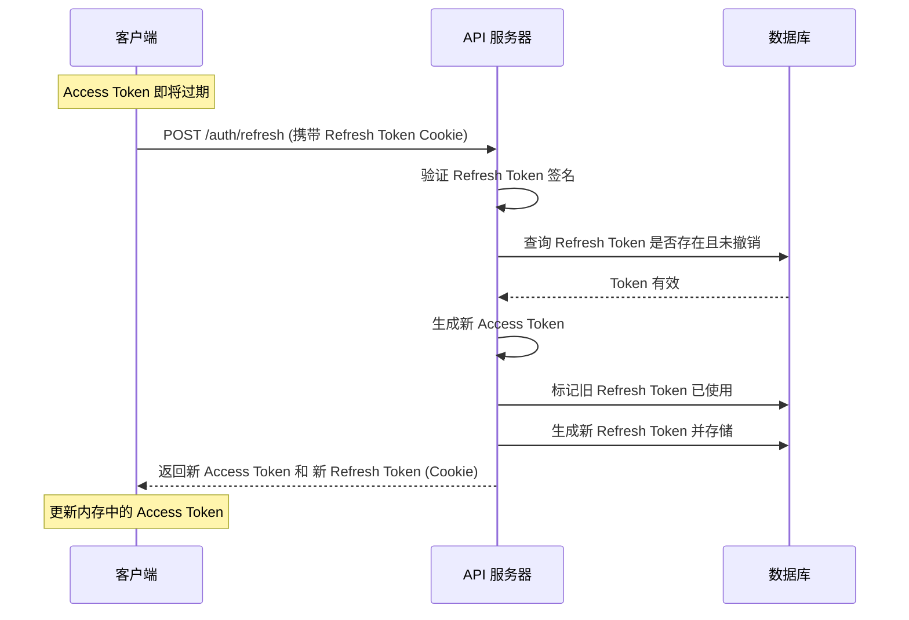
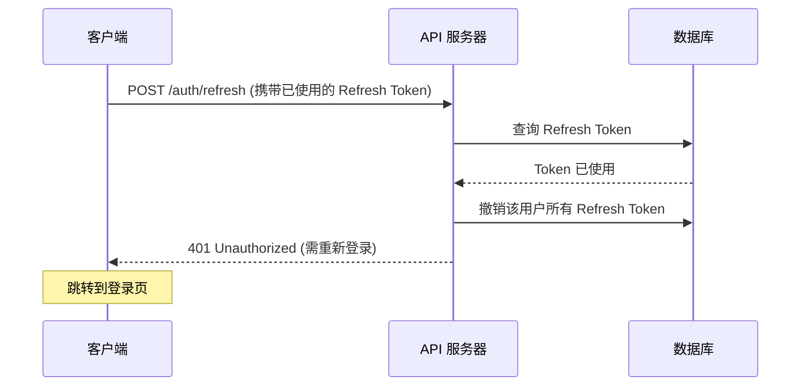
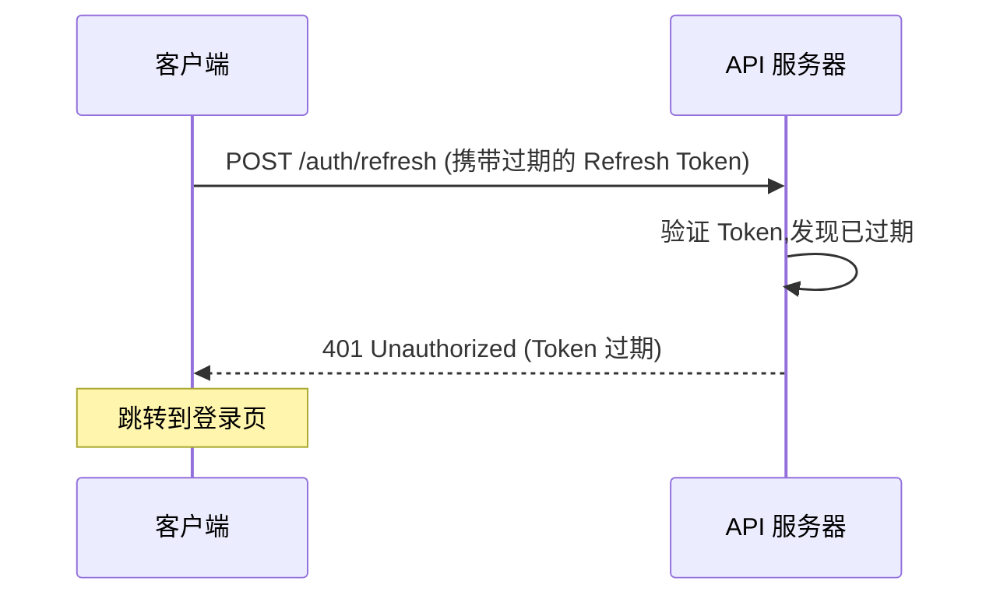

# REQ-001 JWT 认证方案技术调研报告

## 文档信息

- **需求编号**: REQ-001
- **需求名称**: 用户认证与授权
- **文档类型**: 技术调研报告
- **版本**: v1.0
- **创建日期**: 2026-02-15
- **作者**: architect
- **状态**: 待评审

---

## 1. 调研概述

### 1.1 调研目标

为视频会议系统 MVP v0.1 确定安全可靠的用户认证方案,确保:
- **安全性**: 防止未授权访问和 Token 泄露
- **可用性**: 良好的用户体验,减少登录频率
- **可扩展性**: 支持水平扩展,适应高并发场景
- **可维护性**: 方案清晰易于实现和维护

### 1.2 调研范围

本次调研涵盖以下技术方案:
1. JWT 双令牌机制(Access Token + Refresh Token)
2. Token 存储策略
3. Token 刷新流程
4. 密码加密方案(bcrypt)
5. API 限流策略

---

## 2. JWT 认证方案对比

### 2.1 方案一: Session + Cookie (传统方案)

#### 工作原理

```
用户登录 → 服务端创建 Session → 返回 Session ID (Cookie)
    ↓
用户访问 → 携带 Cookie → 服务端查询 Session → 验证通过
```

#### 优势

- **成熟稳定**: 传统方案,实现简单
- **易于撤销**: 直接删除 Session 记录即可
- **安全性高**: Cookie 可设置 HttpOnly,防止 XSS

#### 劣势

- **扩展性差**: 需要服务端存储 Session,水平扩展困难
  - 方案 A: Session 复制(消耗资源)
  - 方案 B: Session 共享存储(单点故障风险)
  - 方案 C: Sticky Session(负载不均衡)
- **跨域困难**: Cookie 受同源策略限制
- **移动端不友好**: Native App 处理 Cookie 复杂

#### 适用场景

- 单体应用
- 对扩展性要求不高的场景

---

### 2.2 方案二: 单 JWT Token

#### 工作原理

```
用户登录 → 服务端签发 JWT Token → 返回 Token
    ↓
用户访问 → 携带 Token (Authorization: Bearer) → 服务端验证签名 → 通过
```

#### 优势

- **无状态**: 服务端无需存储,水平扩展容易
- **跨域友好**: Token 可在任意域使用
- **移动端友好**: 统一使用 HTTP Header 传递
- **自包含**: Token 包含用户信息,无需查询数据库

#### 劣势

- **无法撤销**: JWT 签发后无法主动失效,只能等待过期
  - 用户登出后 Token 仍然有效
  - 密码修改后旧 Token 仍可使用
  - 异常情况无法立即封禁
- **Token 泄露风险**:
  - 长期有效的 Token 泄露后危害大
  - 短期 Token 则需要频繁登录,用户体验差
- **负载较大**: 每次请求都需要传输完整 Token

#### 适用场景

- 对安全要求不高的场景
- 短期访问场景

---

### 2.3 方案三: JWT 双令牌机制 (推荐) ✅

#### 工作原理

```
用户登录
    ↓
生成 Access Token (1小时) + Refresh Token (7天)
    ↓
Access Token 用于 API 访问
    ↓
Access Token 过期 → 使用 Refresh Token 刷新 → 获取新 Access Token
    ↓
Refresh Token 过期 → 重新登录
```

#### 优势

- **安全性高**:
  - Access Token 短期有效,泄露风险小
  - Refresh Token 长期有效,存储在 HttpOnly Cookie,防 XSS
  - 可在数据库中撤销 Refresh Token
- **用户体验好**:
  - Access Token 自动续期,用户无感知
  - 7 天内无需重新登录
- **可扩展**:
  - Access Token 无状态,支持水平扩展
  - Refresh Token 数量少,存储压力小
- **可控性强**:
  - 可随时撤销 Refresh Token
  - 支持异常登录检测和强制登出

#### 劣势

- **实现复杂**: 需要维护 Token 刷新逻辑
- **存储开销**: Refresh Token 需要数据库存储
- **客户端复杂**: 需要处理 Token 刷新逻辑

#### 适用场景

- 企业级应用 ✅
- 对安全和用户体验都有要求的场景 ✅

---

### 2.4 方案对比总结

| 特性 | Session+Cookie | 单 JWT | JWT 双令牌 |
|------|---------------|--------|-----------|
| **安全性** | 高 | 中 | 高 ✅ |
| **用户体验** | 中 | 低/中 | 高 ✅ |
| **可扩展性** | 低 | 高 | 高 ✅ |
| **可撤销性** | 高 | 无 | 高 ✅ |
| **跨域支持** | 差 | 好 | 好 ✅ |
| **移动端友好** | 差 | 好 | 好 ✅ |
| **实现复杂度** | 低 | 低 | 中 |
| **存储开销** | 高 | 无 | 低 |

**选型结论**: 采用 **JWT 双令牌机制** ✅

**理由**:
1. 兼顾安全性和用户体验
2. 支持水平扩展,满足高并发需求
3. 可撤销,满足合规要求(GDPR、等保)
4. 跨平台友好,支持 Web、Electron、iOS、Android

---

## 3. Token 配置方案

### 3.1 Access Token 设计

#### Payload 结构

```json
{
  "sub": "user_123456789",           // 用户 ID
  "email": "user@example.com",       // 用户邮箱
  "nickname": "张三",                 // 用户昵称
  "roles": ["user"],                  // 角色列表
  "iat": 1707894000,                  // 签发时间
  "exp": 1707897600,                  // 过期时间 (1小时后)
  "jti": "uuid-v4-token-id"           // Token ID (唯一标识)
}
```

#### 技术参数

| 参数 | 值 | 说明 |
|------|----|----|
| **签名算法** | RS256 | RSA + SHA-256,非对称加密 |
| **密钥长度** | 2048 位 | 符合安全标准 |
| **有效期** | 1 小时 | 平衡安全性和用户体验 |
| **存储位置** | 内存 (客户端) | 减少持久化泄露风险 |

#### 为什么选择 RS256?

**RS256 vs HS256 对比**:

| 特性 | HS256 (对称) | RS256 (非对称) ✅ |
|------|-------------|-----------------|
| **密钥类型** | 单一密钥 | 公钥 + 私钥 |
| **验证方** | 需要密钥 | 只需公钥 |
| **密钥泄露风险** | 高(验证方可签发) | 低(验证方无法签发) |
| **微服务场景** | 需共享密钥 | 公钥可公开 |
| **性能** | 快 | 稍慢(可接受) |

**选择 RS256 的理由**:
1. **安全性高**: 私钥仅存储在认证服务器,验证方无法伪造 Token
2. **便于扩展**: 公钥可分发到多个微服务,无需共享密钥
3. **密钥轮换**: 私钥泄露时只需更换密钥对,不影响验证方

---

### 3.2 Refresh Token 设计

#### Payload 结构

```json
{
  "sub": "user_123456789",           // 用户 ID
  "type": "refresh",                  // Token 类型
  "iat": 1707894000,                  // 签发时间
  "exp": 1708498800,                  // 过期时间 (7天后)
  "jti": "uuid-v4-token-id"           // Token ID (唯一标识)
}
```

#### 技术参数

| 参数 | 值 | 说明 |
|------|----|----|
| **签名算法** | RS256 | 与 Access Token 一致 |
| **有效期** | 7 天 | 平衡安全性和便利性 |
| **存储位置** | HttpOnly Cookie | 防止 XSS 攻击 |
| **数据库存储** | 是 | 支持撤销和审计 |
| **使用次数** | 一次性 | 使用后立即作废 |

#### Cookie 配置

```typescript
res.cookie('refresh_token', token, {
  httpOnly: true,      // 防止 JavaScript 访问
  secure: true,        // 仅 HTTPS 传输
  sameSite: 'strict',  // 防止 CSRF 攻击
  maxAge: 7 * 24 * 60 * 60 * 1000,  // 7天
  path: '/auth/refresh',  // 限定路径
});
```

---

### 3.3 Token 存储策略对比

#### Access Token 存储

| 存储方式 | 优势 | 劣势 | 是否采用 |
|---------|------|------|---------|
| **内存** | 刷新页面自动清除,安全性高 | 刷新页面需重新登录 | ✅ 是 |
| **localStorage** | 持久化,刷新页面无需重新登录 | 易受 XSS 攻击 | ❌ 否 |
| **sessionStorage** | 关闭标签页自动清除 | 多标签页不共享 | ❌ 否 |
| **Cookie** | 自动携带,服务端可控 | 需处理 CSRF,跨域复杂 | ❌ 否 |

**选型**: 内存存储 ✅
- Web: 使用 React Context / Zustand 存储
- Electron: 使用内存变量存储
- 配合 Refresh Token 自动续期,用户无感知

#### Refresh Token 存储

| 存储方式 | 优势 | 劣势 | 是否采用 |
|---------|------|------|---------|
| **HttpOnly Cookie** | 防 XSS,服务端可控 | 需处理 CSRF(已用 SameSite) | ✅ 是 |
| **localStorage** | 客户端完全控制 | 易受 XSS 攻击 | ❌ 否 |

**选型**: HttpOnly Cookie ✅
- 最高安全级别
- 服务端可控(设置过期时间、撤销)
- 配合 SameSite=Strict 防止 CSRF

---

## 4. Token 刷新流程

### 4.1 正常刷新流程



**关键点**:
1. **Refresh Token 一次性使用**: 防止重放攻击
2. **同时刷新两个 Token**: 滚动更新机制
3. **数据库记录**: 支持审计和撤销

---

### 4.2 异常情况处理

#### 情况一: Refresh Token 已使用(检测到重放攻击)



**安全措施**: 检测到重放攻击时,强制用户重新登录

---

#### 情况二: Refresh Token 过期



---

#### 情况三: 并发刷新请求(客户端 Bug)

**问题**: 客户端同时发送多个刷新请求

**解决方案**: 分布式锁

```typescript
async refreshToken(userId: string, tokenId: string): Promise<TokenPair> {
  // 使用 Redis 分布式锁
  const lock = await redis.lock(`refresh:${userId}:${tokenId}`, 5000);

  try {
    // 检查 Token 是否已使用
    const token = await db.findRefreshToken(tokenId);
    if (token.used) {
      throw new Error('Token already used');
    }

    // 生成新 Token
    const newTokens = await this.generateTokenPair(userId);

    // 标记旧 Token 已使用
    await db.markTokenUsed(tokenId);

    return newTokens;
  } finally {
    await lock.unlock();
  }
}
```

---

### 4.3 客户端刷新策略

#### 策略一: 被动刷新

```typescript
// 拦截 API 响应
axios.interceptors.response.use(
  response => response,
  async error => {
    if (error.response?.status === 401) {
      // Token 过期,尝试刷新
      const newToken = await refreshToken();
      // 重试原请求
      error.config.headers.Authorization = `Bearer ${newToken}`;
      return axios.request(error.config);
    }
    return Promise.reject(error);
  }
);
```

**问题**: 第一个请求失败,用户体验差

---

#### 策略二: 主动刷新 (推荐) ✅

```typescript
// 定时检查 Token 是否即将过期
setInterval(async () => {
  const token = getAccessToken();
  const decoded = jwt.decode(token);
  const expiresIn = decoded.exp * 1000 - Date.now();

  // 提前 5 分钟刷新
  if (expiresIn < 5 * 60 * 1000) {
    await refreshToken();
  }
}, 60 * 1000);  // 每分钟检查一次
```

**优势**: 用户无感知,所有请求都使用有效 Token

---

## 5. 密码加密方案

### 5.1 bcrypt 算法

#### 为什么选择 bcrypt?

**常见哈希算法对比**:

| 算法 | 类型 | 速度 | 是否加盐 | 是否可调整强度 | 是否推荐 |
|------|------|------|---------|--------------|---------|
| **MD5** | 哈希 | 极快 | ❌ | ❌ | ❌ 不安全 |
| **SHA-256** | 哈希 | 快 | 需手动 | ❌ | ❌ 易暴力破解 |
| **bcrypt** | KDF | 慢 | ✅ | ✅ | ✅ 推荐 |
| **scrypt** | KDF | 慢 | ✅ | ✅ | ✅ 推荐 |
| **Argon2** | KDF | 慢 | ✅ | ✅ | ✅ 最佳 |

**bcrypt 优势**:
1. **内置加盐**: 自动生成随机盐,防止彩虹表攻击
2. **慢速计算**: 故意设计为慢速,增加暴力破解成本
3. **可调整强度**: Cost Factor 参数可随硬件升级调整
4. **成熟稳定**: 广泛应用,库支持完善

**为什么不选 Argon2?**
- bcrypt 已足够安全,MVP 阶段无需过度设计
- bcrypt 生态更成熟,库更稳定
- 后续可按需升级到 Argon2

---

### 5.2 bcrypt 参数配置

#### Cost Factor 选择

| Cost | 耗时 (2023 年硬件) | 安全性 | 用户体验 | 是否采用 |
|------|-------------------|--------|---------|---------|
| 10 | ~100ms | 中 | 好 | ❌ 偏弱 |
| **12** | ~400ms | 高 | 可接受 | ✅ 推荐 |
| 14 | ~1.6s | 很高 | 差 | ❌ 太慢 |

**选型**: Cost = 12 ✅

**理由**:
- 400ms 耗时用户可接受(登录不频繁)
- 足以抵御暴力破解(每秒仅 2.5 次尝试)
- 硬件升级后可调整到 13 或 14

---

### 5.3 实现代码

#### 注册时加密密码

```typescript
import * as bcrypt from 'bcrypt';

async function registerUser(email: string, password: string) {
  // 生成哈希(自动加盐)
  const passwordHash = await bcrypt.hash(password, 12);

  // 存储到数据库
  await db.users.create({
    email,
    password_hash: passwordHash,
  });
}
```

#### 登录时验证密码

```typescript
async function loginUser(email: string, password: string) {
  // 查询用户
  const user = await db.users.findOne({ email });
  if (!user) {
    throw new Error('用户不存在');
  }

  // 验证密码
  const isValid = await bcrypt.compare(password, user.password_hash);
  if (!isValid) {
    throw new Error('密码错误');
  }

  // 生成 JWT Token
  return generateTokenPair(user.id);
}
```

---

## 6. API 限流策略

### 6.1 为什么需要限流?

**攻击场景**:
1. **暴力破解**: 短时间内尝试大量密码
2. **撞库攻击**: 使用泄露的邮箱密码批量尝试
3. **DDoS 攻击**: 大量请求导致服务不可用
4. **爬虫**: 恶意爬取数据

**防护目标**:
- 防止暴力破解
- 保护服务器资源
- 保证正常用户访问

---

### 6.2 限流算法对比

#### 算法一: 固定窗口

```
时间窗口: [0s-60s] [60s-120s]
限制: 每个窗口 100 次请求

问题: 临界问题
例: 0:59 发送 100 次,1:01 发送 100 次 → 2秒内 200 次
```

**优势**: 实现简单
**劣势**: 存在突刺流量(Burst)

---

#### 算法二: 滑动窗口 (推荐) ✅

```
时间窗口: 滚动 60s
限制: 任意 60s 内 100 次请求

实现: Redis Sorted Set
zadd key timestamp value
zremrangebyscore key 0 (now-60s)
zcard key → 获取计数
```

**优势**:
- 精确限流,无突刺问题
- 适合精确控制场景

**劣势**:
- 占用内存较多(需存储每次请求时间戳)

---

#### 算法三: 令牌桶

```
令牌桶: 固定速率生成令牌(如 100/分钟)
请求: 消耗 1 个令牌
桶满: 丢弃多余令牌

优势: 允许短时突发(桶内有余量)
```

**优势**: 允许合理的突发流量
**劣势**: 实现稍复杂

---

### 6.3 限流策略配置

#### 分级限流

| API 端点 | 限流方式 | 限制 | 窗口期 | 说明 |
|---------|---------|------|-------|------|
| **POST /auth/register** | IP | 3 次 | 60 分钟 | 防止批量注册 |
| **POST /auth/login** | IP + 用户 | 5 次 | 15 分钟 | 防止暴力破解 |
| **POST /auth/refresh** | 用户 | 10 次 | 1 分钟 | 防止滥用 |
| **其他 API** | 用户 | 100 次 | 1 分钟 | 正常访问限制 |
| **WebSocket** | IP | 10 连接 | - | 防止连接耗尽 |

---

### 6.4 实现方案

#### Redis 滑动窗口实现

```typescript
class RateLimiter {
  constructor(private redis: Redis) {}

  /**
   * 检查是否超出限流
   * @param key 限流键(如 ip:192.168.1.1 或 user:123)
   * @param limit 限制次数
   * @param window 时间窗口(秒)
   * @returns 是否允许请求
   */
  async checkLimit(key: string, limit: number, window: number): Promise<boolean> {
    const now = Date.now();
    const windowStart = now - window * 1000;

    const pipeline = this.redis.pipeline();

    // 删除过期记录
    pipeline.zremrangebyscore(key, 0, windowStart);

    // 添加当前请求
    pipeline.zadd(key, now, `${now}-${Math.random()}`);

    // 统计窗口内请求数
    pipeline.zcard(key);

    // 设置过期时间(避免内存泄漏)
    pipeline.expire(key, window + 60);

    const results = await pipeline.exec();
    const count = results[2][1] as number;

    return count <= limit;
  }
}
```

#### 使用示例

```typescript
// NestJS Guard
@Injectable()
export class RateLimitGuard implements CanActivate {
  constructor(private rateLimiter: RateLimiter) {}

  async canActivate(context: ExecutionContext): Promise<boolean> {
    const request = context.switchToHttp().getRequest();
    const ip = request.ip;

    // 登录接口: 5次/15分钟
    if (request.url === '/auth/login') {
      const allowed = await this.rateLimiter.checkLimit(
        `login:ip:${ip}`,
        5,
        15 * 60
      );

      if (!allowed) {
        throw new TooManyRequestsException('请求过于频繁,请15分钟后再试');
      }
    }

    return true;
  }
}
```

---

### 6.5 限流后的响应

#### HTTP 响应

```json
{
  "code": 42901,
  "message": "请求过于频繁,请稍后再试",
  "data": {
    "retry_after": 900  // 秒
  }
}
```

**HTTP Header**:
```
X-RateLimit-Limit: 5           // 限制次数
X-RateLimit-Remaining: 0       // 剩余次数
X-RateLimit-Reset: 1707895800  // 重置时间(Unix时间戳)
Retry-After: 900               // 重试等待时间(秒)
```

---

### 6.6 登录失败锁定策略

**场景**: 连续 5 次密码错误 → 锁定账户 15 分钟

**实现**:

```typescript
async function loginUser(email: string, password: string) {
  // 检查账户是否被锁定
  const lockKey = `lock:user:${email}`;
  const locked = await redis.get(lockKey);
  if (locked) {
    throw new Error('账户已被锁定,请15分钟后再试');
  }

  // 查询用户
  const user = await db.users.findOne({ email });
  if (!user) {
    throw new Error('用户不存在');
  }

  // 验证密码
  const isValid = await bcrypt.compare(password, user.password_hash);
  if (!isValid) {
    // 记录失败次数
    const failKey = `login_fail:${email}`;
    const failCount = await redis.incr(failKey);
    await redis.expire(failKey, 15 * 60);  // 15分钟过期

    if (failCount >= 5) {
      // 锁定账户
      await redis.setex(lockKey, 15 * 60, '1');
      throw new Error('密码错误次数过多,账户已被锁定15分钟');
    }

    throw new Error(`密码错误,还可尝试 ${5 - failCount} 次`);
  }

  // 清除失败记录
  await redis.del(failKey);

  return generateTokenPair(user.id);
}
```

---

## 7. 安全增强措施

### 7.1 Token 黑名单机制

**场景**: 用户主动登出或异常情况需立即撤销 Token

**实现**:

```typescript
// 登出时加入黑名单
async function logout(accessToken: string) {
  const decoded = jwt.decode(accessToken);
  const expiresIn = decoded.exp - Math.floor(Date.now() / 1000);

  // 将 Token ID 加入黑名单,过期时间与 Token 一致
  await redis.setex(`blacklist:${decoded.jti}`, expiresIn, '1');
}

// 验证时检查黑名单
async function verifyToken(token: string) {
  const decoded = jwt.verify(token, publicKey);

  // 检查黑名单
  const blacklisted = await redis.exists(`blacklist:${decoded.jti}`);
  if (blacklisted) {
    throw new Error('Token 已失效');
  }

  return decoded;
}
```

**优化**: 仅对 Access Token 使用黑名单(Refresh Token 存储在数据库,直接撤销)

---

### 7.2 异常登录检测

**检测规则**:

| 异常类型 | 检测方式 | 响应措施 |
|---------|---------|---------|
| **地理位置异常** | IP 地理位置变化超过 1000km | 邮件通知 + 强制 MFA |
| **设备异常** | User-Agent 变化 | 邮件通知 |
| **短时间多次登录** | 5分钟内登录 3 次以上 | 邮件通知 + 验证码 |
| **异常国家登录** | 来自高风险国家 | 拒绝 + 邮件通知 |

**实现**:

```typescript
async function detectAnomalousLogin(
  userId: string,
  ip: string,
  userAgent: string
) {
  // 获取上次登录信息
  const lastLogin = await db.getLastLogin(userId);

  if (lastLogin) {
    // 检查地理位置变化
    const distance = calculateDistance(lastLogin.ip, ip);
    if (distance > 1000) {
      await sendEmail(userId, '检测到异地登录');
      // 要求 MFA 验证
      return { requireMFA: true };
    }

    // 检查设备变化
    if (lastLogin.userAgent !== userAgent) {
      await sendEmail(userId, '检测到新设备登录');
    }
  }

  // 记录本次登录
  await db.saveLoginRecord(userId, ip, userAgent);

  return { requireMFA: false };
}
```

---

### 7.3 HTTPS 强制

**配置**: 生产环境强制使用 HTTPS

**Nginx 配置**:

```nginx
server {
    listen 80;
    server_name api.meeting.example.com;

    # 强制跳转 HTTPS
    return 301 https://$server_name$request_uri;
}

server {
    listen 443 ssl http2;
    server_name api.meeting.example.com;

    # TLS 1.3
    ssl_protocols TLSv1.3;

    # 证书配置
    ssl_certificate /etc/letsencrypt/live/api.meeting.example.com/fullchain.pem;
    ssl_certificate_key /etc/letsencrypt/live/api.meeting.example.com/privkey.pem;

    # HSTS (强制 HTTPS)
    add_header Strict-Transport-Security "max-age=31536000; includeSubDomains" always;
}
```

---

### 7.4 防止 CSRF 攻击

**方案**: SameSite Cookie

```typescript
// Refresh Token Cookie 配置
res.cookie('refresh_token', token, {
  httpOnly: true,
  secure: true,
  sameSite: 'strict',  // 防止 CSRF
});
```

**SameSite 说明**:
- **Strict**: 完全禁止跨站发送 Cookie(最安全)
- **Lax**: 允许导航到目标站点(链接、表单 GET)
- **None**: 允许跨站发送(需配合 Secure)

**选型**: Strict ✅
- MVP 阶段无跨站需求
- 后续若需跨域,可改为 Lax 并增加 CSRF Token

---

## 8. 数据库设计

### 8.1 users 表

```sql
CREATE TABLE users (
  id VARCHAR(50) PRIMARY KEY,
  email VARCHAR(255) UNIQUE NOT NULL,
  password_hash VARCHAR(255) NOT NULL,  -- bcrypt 哈希
  nickname VARCHAR(50) NOT NULL,
  avatar TEXT,
  created_at TIMESTAMP DEFAULT CURRENT_TIMESTAMP,
  updated_at TIMESTAMP DEFAULT CURRENT_TIMESTAMP ON UPDATE CURRENT_TIMESTAMP,

  INDEX idx_email (email)
);
```

---

### 8.2 refresh_tokens 表

```sql
CREATE TABLE refresh_tokens (
  id VARCHAR(50) PRIMARY KEY,           -- Token ID (jti)
  user_id VARCHAR(50) NOT NULL,
  token_hash VARCHAR(255) NOT NULL,     -- Token 哈希(防泄露)
  expires_at TIMESTAMP NOT NULL,
  used_at TIMESTAMP,                     -- 使用时间
  revoked_at TIMESTAMP,                  -- 撤销时间
  ip VARCHAR(45),                        -- IPv6 支持
  user_agent TEXT,
  created_at TIMESTAMP DEFAULT CURRENT_TIMESTAMP,

  INDEX idx_user_id (user_id),
  INDEX idx_expires_at (expires_at),
  FOREIGN KEY (user_id) REFERENCES users(id) ON DELETE CASCADE
);
```

**字段说明**:
- `token_hash`: 存储 Token 的 SHA-256 哈希,而非明文(防止数据库泄露)
- `used_at`: 记录使用时间,用于检测重放攻击
- `revoked_at`: 记录撤销时间,用于主动失效
- `ip` + `user_agent`: 用于异常检测和审计

---

### 8.3 login_logs 表(可选,用于审计)

```sql
CREATE TABLE login_logs (
  id BIGINT AUTO_INCREMENT PRIMARY KEY,
  user_id VARCHAR(50),
  email VARCHAR(255) NOT NULL,
  ip VARCHAR(45) NOT NULL,
  user_agent TEXT,
  success BOOLEAN NOT NULL,              -- 是否成功
  failure_reason VARCHAR(100),           -- 失败原因
  created_at TIMESTAMP DEFAULT CURRENT_TIMESTAMP,

  INDEX idx_user_id (user_id),
  INDEX idx_created_at (created_at),
  INDEX idx_success (success)
);
```

---

## 9. 实施路线图

### 9.1 Phase 1: 基础认证功能 (Week 1-2)

- [ ] 搭建 JWT 签发和验证模块
- [ ] 实现 bcrypt 密码加密
- [ ] 实现用户注册接口
- [ ] 实现用户登录接口
- [ ] 实现登出接口
- [ ] 数据库表设计和迁移
- [ ] 单元测试覆盖 80%+

---

### 9.2 Phase 2: Token 刷新机制 (Week 2-3)

- [ ] 实现 Refresh Token 生成和存储
- [ ] 实现 Token 刷新接口
- [ ] 实现 Refresh Token 一次性使用机制
- [ ] 实现客户端自动刷新逻辑
- [ ] 集成测试

---

### 9.3 Phase 3: 安全增强 (Week 3-4)

- [ ] 实现 API 限流中间件
- [ ] 实现登录失败锁定机制
- [ ] 实现 Token 黑名单机制
- [ ] 实现异常登录检测
- [ ] 配置 HTTPS 和安全头
- [ ] 安全测试(渗透测试)

---

### 9.4 Phase 4: 监控和优化 (Week 4+)

- [ ] 集成安全日志
- [ ] 集成 Prometheus 监控
- [ ] 配置告警规则
- [ ] 性能优化(Token 验证缓存)
- [ ] 文档完善

---

## 10. 技术选型总结

| 技术点 | 方案 | 理由 |
|-------|------|------|
| **认证机制** | JWT 双令牌 | 兼顾安全性、可扩展性和用户体验 |
| **签名算法** | RS256 | 非对称加密,密钥泄露风险低 |
| **Access Token 有效期** | 1 小时 | 平衡安全性和用户体验 |
| **Refresh Token 有效期** | 7 天 | 减少登录频率 |
| **Access Token 存储** | 内存 | 防止持久化泄露 |
| **Refresh Token 存储** | HttpOnly Cookie | 防止 XSS |
| **密码加密** | bcrypt (cost=12) | 成熟稳定,防暴力破解 |
| **限流算法** | 滑动窗口 | 精确限流,无突刺问题 |
| **登录限流** | 5次/15分钟 | 防止暴力破解 |
| **Token 撤销** | 数据库存储 | 支持主动失效和审计 |

---

## 11. 风险评估

### 11.1 技术风险

| 风险 | 严重程度 | 应对措施 |
|------|---------|---------|
| **密钥泄露** | 高 | 密钥独立存储(环境变量/密钥管理服务) |
| **Token 泄露** | 中 | 短期 Access Token + HttpOnly Cookie |
| **暴力破解** | 中 | bcrypt + 限流 + 锁定机制 |
| **重放攻击** | 中 | Refresh Token 一次性使用 |
| **CSRF** | 低 | SameSite Cookie |
| **XSS** | 低 | HttpOnly Cookie + CSP 头 |

---

### 11.2 性能风险

| 风险 | 影响 | 应对措施 |
|------|------|---------|
| **bcrypt 性能** | 登录慢 | Cost=12 可接受(~400ms) |
| **Token 验证** | QPS 受限 | 缓存公钥,无需每次读取 |
| **限流存储** | Redis 压力 | 定期清理过期记录 |
| **数据库查询** | Refresh Token 验证慢 | 添加索引,缓存用户信息 |

---

## 12. 参考资料

### 12.1 标准规范

- [RFC 7519: JSON Web Token (JWT)](https://datatracker.ietf.org/doc/html/rfc7519)
- [RFC 7617: The 'Basic' HTTP Authentication Scheme](https://datatracker.ietf.org/doc/html/rfc7617)
- [OWASP Authentication Cheat Sheet](https://cheatsheetseries.owasp.org/cheatsheets/Authentication_Cheat_Sheet.html)
- [OWASP Password Storage Cheat Sheet](https://cheatsheetseries.owasp.org/cheatsheets/Password_Storage_Cheat_Sheet.html)

### 12.2 技术文章

- [Stop using JWT for sessions](http://cryto.net/~joepie91/blog/2016/06/13/stop-using-jwt-for-sessions/)
- [The Ultimate Guide to handling JWTs on frontend clients](https://hasura.io/blog/best-practices-of-using-jwt-with-graphql/)
- [Refresh Tokens: When to Use Them and How They Interact with JWTs](https://auth0.com/blog/refresh-tokens-what-are-they-and-when-to-use-them/)

### 12.3 开源库

- [node-jsonwebtoken](https://github.com/auth0/node-jsonwebtoken) - JWT 签发和验证
- [bcrypt](https://github.com/kelektiv/node.bcrypt.js) - 密码加密
- [@nestjs/jwt](https://github.com/nestjs/jwt) - NestJS JWT 集成
- [@nestjs/passport](https://github.com/nestjs/passport) - NestJS 认证框架

---

## 附录: 完整代码示例

### A.1 JWT 服务实现

```typescript
// jwt.service.ts
import { Injectable } from '@nestjs/common';
import * as jwt from 'jsonwebtoken';
import * as fs from 'fs';

@Injectable()
export class JwtService {
  private privateKey: Buffer;
  private publicKey: Buffer;

  constructor() {
    // 读取 RSA 密钥对
    this.privateKey = fs.readFileSync('keys/private.pem');
    this.publicKey = fs.readFileSync('keys/public.pem');
  }

  /**
   * 生成 Access Token
   */
  generateAccessToken(userId: string, email: string, nickname: string): string {
    return jwt.sign(
      {
        sub: userId,
        email,
        nickname,
        roles: ['user'],
      },
      this.privateKey,
      {
        algorithm: 'RS256',
        expiresIn: '1h',
        jwtid: this.generateTokenId(),
      }
    );
  }

  /**
   * 生成 Refresh Token
   */
  generateRefreshToken(userId: string): string {
    return jwt.sign(
      {
        sub: userId,
        type: 'refresh',
      },
      this.privateKey,
      {
        algorithm: 'RS256',
        expiresIn: '7d',
        jwtid: this.generateTokenId(),
      }
    );
  }

  /**
   * 验证 Token
   */
  verifyToken(token: string): any {
    return jwt.verify(token, this.publicKey, {
      algorithms: ['RS256'],
    });
  }

  /**
   * 生成 Token ID
   */
  private generateTokenId(): string {
    return `${Date.now()}-${Math.random().toString(36).substr(2, 9)}`;
  }
}
```

---

**文档版本**: v1.0
**创建日期**: 2026-02-15
**审核状态**: 待评审
**维护人**: architect
