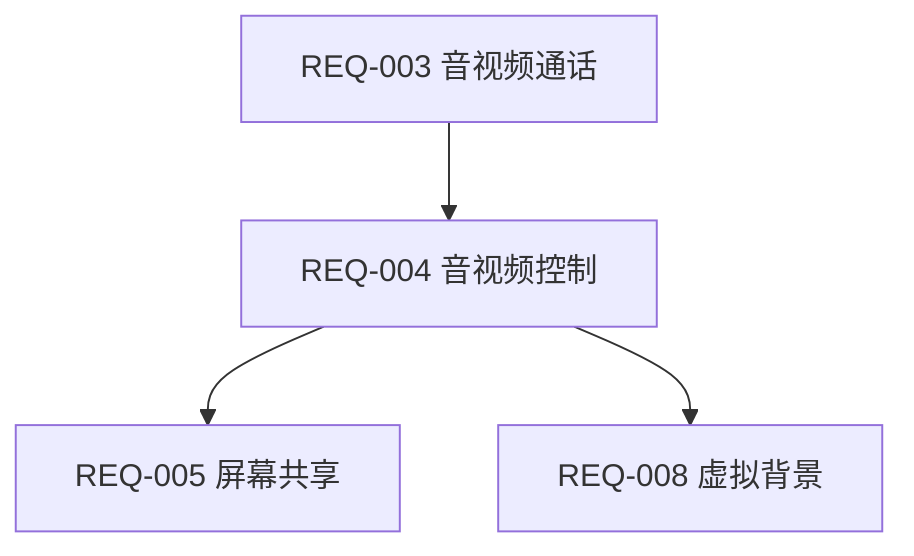

# REQ-004 音视频控制功能 - 启动文档

## 项目信息
- **需求编号**: REQ-004
- **需求名称**: 音视频控制功能
- **优先级**: P0
- **依赖**: REQ-003 实时音视频通话（已完成）
- **启动日期**: 2026-02-26
- **负责人**: team-lead

## 功能概述

### 核心功能点
1. **麦克风控制**：本地静音/取消静音
2. **摄像头控制**：开启/关闭本地视频
3. **本地预览**：摄像头关闭时显示头像占位
4. **远端状态指示**：显示其他参与者静音/摄像头状态
5. **默认状态配置**：进入会议时的默认设备状态

### 技术基础
- 基于 REQ-003 已实现的 mediasoup SFU 架构
- 复用 WebSocket 信令连接和 JWT 认证体系
- 使用 Producer pause/resume 机制实现控制功能

## 开发流程

### 阶段 1：需求分析（Task #107）
- **负责人**: product-manager
- **输出**: analysis.md
- **状态**: 待开始

### 阶段 2：UI/UX 设计（Task #108）
- **负责人**: frontend-leader
- **依赖**: Task #107 完成
- **输出**: designs/ 目录

### 阶段 3：技术方案调研（Task #109）
- **负责人**: architect
- **依赖**: Task #108 完成
- **输出**: tech_research.md

### 阶段 4：评审（Task #110）
- **负责人**: team-lead
- **依赖**: Task #109 完成
- **输出**: review.md, api_contract.md

### 阶段 5：并行开发（Tasks #111-113）
- **后端实现**（Task #111）：backend-leader
- **前端实现**（Task #112）：frontend-leader
- **客户端集成**（Task #113）：client-leader
- **依赖**: Task #110 完成

### 阶段 6：集成测试（Task #114）
- **负责人**: test-leader
- **依赖**: Tasks #111-113 完成
- **输出**: test_cases.md, test_report.md

### 阶段 7：部署（Task #115）
- **负责人**: devops-leader
- **依赖**: Task #114 完成

## 验收标准

### 功能验收
- [ ] 静音后其他人听不到声音
- [ ] 关闭摄像头后其他人看不到视频
- [ ] 状态变化实时同步到其他端（延迟 < 100ms）
- [ ] 设备切换实时生效
- [ ] 关闭摄像头时显示用户头像/昵称占位

### 性能要求
- 控制操作延迟：< 100ms
- 状态同步延迟：< 200ms
- 设备枚举时间：< 500ms

### 兼容性要求
- Web 端：Chrome 90+, Safari 14+, Firefox 88+, Edge 90+
- Electron：Windows 10+, macOS 11+

## 关键依赖关系



## 团队协作

### 主 Team 成员
- **team-lead**: 整体协调、进度跟踪
- **product-manager**: 需求分析、产品设计
- **architect**: 技术方案、架构设计
- **frontend-leader**: UI/UX 设计、前端实现
- **backend-leader**: 后端服务实现
- **client-leader**: 客户端集成
- **test-leader**: 测试策略、质量把控
- **devops-leader**: 部署运维

### 沟通机制
- 各阶段完成后自动通知下一阶段负责人
- 重大问题通过 SendMessage 工具及时沟通
- 评审会议由 team-lead 组织协调

## 文档结构

```
REQ-004/
├── analysis.md          # 需求分析文档
├── designs/            # UI/UX 设计文件
├── tech_research.md    # 技术方案调研
├── review.md           # 评审报告
├── api_contract.md     # 接口契约
├── backend_implementation_report.md
├── frontend-implementation.md
├── electron-verification.md
├── test_cases.md       # 测试用例
├── test_report.md     # 测试报告
├── deployment_notes.md # 部署记录
└── startup.md         # 本启动文档
```

## 风险与应对

### 技术风险
- **Producer pause/resume 机制稳定性**：已在 REQ-003 验证基础功能
- **状态同步一致性**：设计强一致性信令协议
- **跨平台兼容性**：基于 REQ-003 已验证的兼容性方案

### 进度风险
- **依赖 REQ-003 完成**：REQ-003 已基本完成，风险可控
- **多端并行开发协调**：通过接口契约明确分工，减少耦合

## 里程碑计划

| 阶段 | 预计完成时间 | 关键交付物 |
|------|-------------|-----------|
| 需求分析 | 2026-02-27 | analysis.md |
| UI/UX 设计 | 2026-02-28 | designs/ |
| 技术方案 | 2026-02-29 | tech_research.md |
| 评审 | 2026-03-01 | api_contract.md |
| 并行开发 | 2026-03-05 | 各端功能代码 |
| 集成测试 | 2026-03-07 | test_report.md |
| 部署上线 | 2026-03-08 | 生产环境验证 |

---

**文档状态**: 创建完成
**维护人**: team-lead
**更新时间**: 2026-02-26